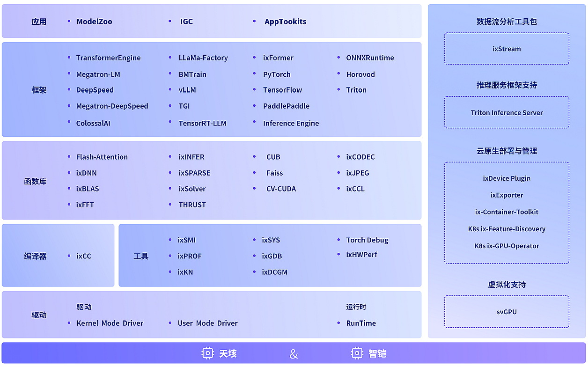
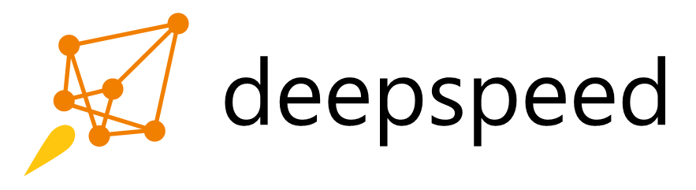
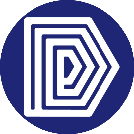
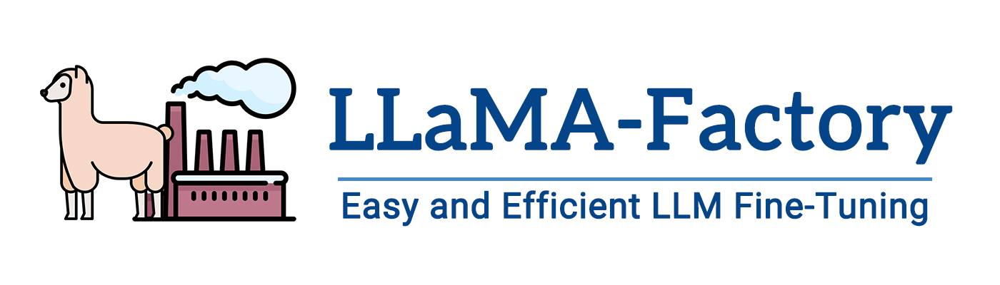
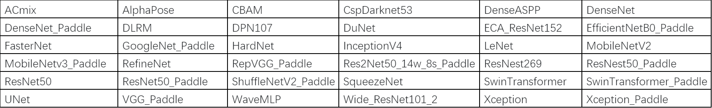

 

# DeepSpark开源社区

  
  
  

 

在万物皆算的时代，各领域应用层出不穷，算力必须支撑实际应用，通用性和未来可扩展性是评估算力的重要指标。天数智芯作为国内头部通用GPU高端芯片及超级算力系统提供商，截止2024年12月，已成功支持 400+ AI算法模型，覆盖训练和推理，与 400+ 家客户和生态伙伴建立合作，共同促进国内通用算力的发展，产品服务于智慧城市、数字个人、医疗、教育、通信、能源等多个领域。

天数智芯本着“平台共建、生态共享、产业共赢”的原则，致力于和行业伙伴一起打造[DeepSpark开源社区](https://www.deepspark.org.cn/)，以来自开源回馈开源的方式，汇聚社区力量，助力客户加速应用落地和收获算力赋能，促进产业生态的完善和发展。

DeepSpark开源社区目前主要致力于[百大应用开放平台](#百大应用开放平台)的打造和推广。除此之外DeepSpark社区于2023年3月开源上线了适用于国产通用GPU[天垓100](https://www.iluvatar.com/productDetails?fullCode=cpjs-yj-xlxl-tg100)的CUDA应用程序调试工具[ixGDB](https://gitee.com/deep-spark/ixgdb)。将来会有更多相关的项目和成果通过DeepSpark社区开源。

2023年8月，DeepSpark开源社区与[上海白玉兰开源开放研究院](http://baiyulan.org.cn/)签署了战略合作协议，旨在进一步促进人工智能开源事业共建共享，推动产业生态的完善和发展。2023年11月，DeepSpark社区与[启智社区](https://openi.pcl.ac.cn/)开展合作，社区用户可通过启智云脑提供的[天垓100算力](https://openi.pcl.ac.cn/iluvatar/TianGai100)训练来自DeepSparkHub的模型。

欢迎行业合作伙伴、社区用户和开发者以任何形式为DeepSpark开源社区作贡献，期待您的积极参与。

--------

## 百大应用开放平台

百大应用开放平台作为国内领先的AI和通用计算应用开发及评测平台，甄选上百个与行业应用深度耦合的开源算法和模型，支持主流生态应用框架，并针对行业需求构建多维度评测体系，广泛支持各类落地场景。

### 应用算法和模型

[DeepSparkHub](https://gitee.com/deep-spark/deepsparkhub)甄选上百个开源应用算法和模型，覆盖AI和通用计算各领域，支持主流市场智能计算场景，包括智慧城市、数字个人、医疗、教育、通信、能源等多个领域。

[DeepSparkInference](https://gitee.com/deep-spark/deepsparkinference)精选基于国产推理引擎IGIE和IxRT的推理模型示例和指导文档，部分模型提供了基于国产通用GPU[智铠100](https://www.iluvatar.com/productDetails?fullCode=cpjs-yj-tlxltt-zk100)的评测结果。

### 天数智芯智算平台 IXUCA

IXUCA兼容主流GPU通用计算模型，提供支持主流GPU通用计算模型的等效组件、特性、API和算法，可助力用户便捷地实现系统或应用的无痛迁移。天数智算软件栈包括人工智能深度学习应用、主流框架、函数库、编译器及工具、运行时库及驱动。

- IXUCA集成了TensorFlow、PyTorch、百度飞桨PaddlePaddle等国内外主流的深度学习框架，提供与官方开源框架一致的算子，并针对天数智芯加速卡持续优化性能。

- IXUCA提供IGIE推理框架和IxRT推理引擎，支持在天数智芯加速卡上实现最优推理性能。

- IXUCA的函数库不仅支持通用计算还提供了深度学习应用开发所需的基础算子，开发者可以便捷地调用这些算子灵活地构造各类深度神经网络模型以及其他机器学习领域的算法。

您可前往天数智芯官方网站的[资源中心](https://support.iluvatar.com/#/ProductLine?id=2)获取天数智算软件栈。

### 应用框架

百大应用开放平台支持国内外主流应用框架和工具箱。

<table border="0">
    <tr align="center">
        <td><a href="https://github.com/pytorch"></td>
        <td><a href="https://github.com/tensorflow"></td>
    </tr>
    <tr align="center">
        <td><a href="https://github.com/paddlepaddle"></td>
        <td><a href="https://github.com/microsoft/DeepSpeed"></td>
    </tr>
    <tr align="center">
        <td><a href="https://github.com/facebookresearch/fairseq"></td>
        <td><a href="https://github.com/open-mmlab/mmdetection"></td>
    </tr>
    <tr align="center">
        <td><a href="https://github.com/wenet-e2e/wenet"></td>
        <td><a href="https://github.com/hpcaitech/ColossalAI"></td>
    </tr>
    <tr align="center">
        <td><a href="https://github.com/deepmodeling"></td>
        <td><a href="https://github.com/hiyouga/LLaMA-Factory"></td>
    </tr>
</table>

### 评测体系

评测标准广泛适用于硬件平台，体系完备，部署简单。

- 提供6️⃣维度

| 维度       | 说明                                                           | 数据来源                  | 计算方法                                                                                                                                |
|------------|----------------------------------------------------------------|---------------------------|-----------------------------------------------------------------------------------------------------------------------------------------|
| 速度🚀     | 模型稳定训练时每秒处理的单位样本的算力                         | DeepSpark模型训练脚本输出 | 指定迭代轮次5次去掉最高最低，取中间3次的mean中值                                                                                        |
| 准确性🎯   | 模型收敛的精度值                                               | DeepSpark模型训练脚本输出 | 记录模型收敛时的精度值                                                                                                                  |
| 线性度📈   | 模型集群规模化训练算力的线性扩展性能，包括卡线性度和节点线性度 | DeepSpark模型训练脚本输出 | 用多卡/多节点的训练速度除以卡数/节点数，再对比使用单张/单节点的训练速度                                                                 |
| 功耗🔌     | 模型稳定训练时候实际消耗的GPU平均功耗                          | GPU实时状态检测工具       | 取多次的功耗数据的平均值                                                                                                                |
| 显存占用📊 | 模型稳定训练时实际消耗的GPU平均显存占用量                      | GPU实时状态检测工具       | 取多次的显存占用量的平均值                                                                                                              |
| 稳定度🔧   | 多次完整训练（均达到收敛值）的收敛值的稳定程度                 | DeepSpark模型训练脚本输出 | 采用5次达到标准收敛值的完整训练，取收敛值的中值做为基准值，其它值对比基准值的差值百分比有1次不在（-0.01，+0.01）范围内，稳定度则递减20% |

参考信息：[硬件评测结果](#硬件评测方法和结果)

- 1️⃣键式部署：全自动✅ 、数据可复现🔁、场景可寻源🔎

- 0️⃣平台依赖：不限制框架、不限制源语、不限制硬件

### 多维度评测系统

[多维度评测系统](https://mdb.deepspark.org.cn:8086)是一款基于[多维度评测体系标准](#评测体系)开发的线上评测工具，通过在同等条件下对BI-V100和NV-V100加速卡在六个维度（速度，准确度，线性度，功耗效率，显存效率，稳定性）上进行模型训练评测、指标
收集和六维度雷达图展示，方便用户更加全面的对比评估GPU加速卡的综合能力。以下为已支持的模型列表：

使用方法详见[多维度评测系统使用指南](evaluation/Iluvatar/Mdims-benchmark.md)。

--------

### 硬件评测方法和结果

#### 天垓100通用GPU

评测方法详见[天垓100六维度评测方法](evaluation/Iluvatar/six_dimension_howto.md)。

评测结果如下：

| 任务         | 模型       | 收敛指标         | 配置(x-\>gpus)        | 速度   | 准确度 | 功耗（W） | 线性度 | 显存占用（G） | 稳定度 |
|--------------|------------|------------------|-----------------------|--------|--------|-----------|--------|---------------|--------|
| 自然语言处理 | BERT-large | 0.72             | sdk2.2,bs:32,8x,amp   | 214    | 0.72   | 152\*8    | 0.96   | 20.3\*8       | 1      |
| 推荐系统     | DLRM       | AUC:0.75         | sdk2.2,bs:2048,8x,amp | 793486 | 0.75   | 60\*8     | 0.97   | 3.7\*8        | 1      |
| 图像分类     | ResNet50   | top1 75.9%       | sdk2.2,bs:512,8x,amp  | 5221   | 76.43% | 128\*8    | 0.97   | 29.1\*8       | 1      |
| 图像分割     | 3D U-Net   | 0.908            | sdk2.2,bs:4,8x,fp32   | 12     | 0.908  | 152\*8    | 0.85   | 19.6\*8       | 1      |
| 目标检测     | YOLOv5     | mAP:0.5          | sdk2.2,bs:128,8x,amp  | 1228   | 0.56   | 140\*8    | 0.92   | 27.3\*8       | 1      |
| 文本检测     | SATRN      | 0.841            | sdk2.2,bs:128,8x,fp32 | 630    | 88.4   | 166\*8    | 0.98   | 28.5\*8       | 1      |
| 语音识别     | Conformer  | 3.72             | sdk2.2,bs:32,8x,fp32  | 380    | 4.79   | 113\*8    | 0.82   | 21.5\*8       | 1      |
| 3D重建       | ngp-nerf   | 0.0046           | sdk2.2,bs:1,8x,amp    | 10     | 19.6   | 82\*8     | 0.90   | 28.1\*8       | 1      |
| 目标追踪     | FairMOT    | MOTA:69.8        | sdk2.2,bs:64,8x,fp32  | 52     | 69.8   | 132\*8    | 0.97   | 19.1\*8       | 1      |
| 大模型       | CPM        | 0.91             | sdk2.2,bs:128,8x,amp  | 357    | 0.91   | 156\*8    | 0.93   | 20.6\*8       | 1      |
| 语音语义     | Tacotron2  | score(MOS):4.460 | sdk2.2,bs:128,8x,amp  | 77     | 4.46   | 128\*8    | 0.96   | 18.4\*8       | 1      |
| 新兴模型     | Wave-MLP   | 80.1             | sdk2.2,bs:256,8x,fp32 | 1026   | 83.1   | 198\*8    | 0.98   | 29.4\*8       | 1      |

--------

## 社区

### 治理

请参见 [Code of Conduct](CODE_OF_CONDUCT.md)。

### 交流

请联系 <contact@deepspark.org.cn>。

### 贡献

请参见各项目的Contributing Guidelines。

### 许可证

[Apache License 2.0](LICENSE)。
