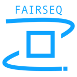

# DeepSpark百大应用开放平台

DeepSpark百大应用开放平台作为国内首个AI和通用计算应用开发及评测平台，基于天数智芯及其行业伙伴的应用落地经验，分享与落地应用深度耦合的百大应用算法和模型，覆盖各应用领域，并针对行业需求构建多维度测评体系，广泛支持各类落地场景。

## 组成部分

### 应用算法和模型

百大应用开放平台甄选上百个[应用算法和模型](https://gitee.com/deep-spark/deepsparkhub)，覆盖AI和通用计算各领域，支持主流市场智能计算场景，包括智慧城市、数字个人、医疗、教育、通信、能源等多个领域。

### 应用框架

百大应用开放平台将支持国内外主流应用框架和工具箱。

<table border="0">
    <tr>
        <td></td>
        <td></td>
    </tr>
    <tr>
        <td></td>
        <td></td>
    </tr>
    <tr>
        <td></td>
        <td></td>
    </tr>
    <tr>
        <td></td>
        <td></td>
    </tr>
    <tr>
        <td></td>
        <td></td>
    </tr>
</table>

注：目前发布主要支持PyTorch和PaddlePaddle框架。

### 评测体系

评测标准广泛适用于硬件平台，体系完备，部署简单。

- 提供 :six: 维度

| 维度 | 说明 |
| --- | --- |
| 速度 :rocket:  | 单机模型稳定训练时每秒处理的单位样本的算力， 即指定迭代轮次5次去掉最高最低，取中间3次的mean中值。 |
| 准确性 :dart: | 模型收敛的精度值。
| 线性度 :chart_with_upwards_trend: | 模型集群规模化训练的scalability，算力线性扩展性能。 多节点对单节点的线性度，多节点对单卡的线性度。
| 功耗 :electric_plug: | 模型训练稳定训练时候实际消耗的GPU平均功耗。
| 显存 :bar_chart: | 模型训练稳定训练时候实际消耗的GPU平均显存用量。
| 稳定度 :wrench: | 模型采用5次完整训练，收敛的波动性和稳定度在（-0.01，+0.01）合理区间， 5个数据有一次不在范围内就递减20%。

   参考信息：[硬件评测结果](#硬件评测结果)

- 支持 :one: 键式部署

   全自动 :white_check_mark: 、数据可复现 :repeat: 、场景可寻源 :mag_right:

- :zero: 平台依赖

   不限制框架、不限制源语、不限制硬件
   
--------

## 硬件评测结果

### 天垓100通用GPU

| 任务         | 模型       | 收敛指标         | 配置(x-\>gpus)        | 速度   | 准确度 | 功耗（W） | 线性度 | 显存（G） | 稳定度 |
|--------------|------------|------------------|-----------------------|--------|--------|-----------|--------|-----------|--------|
| 自然语言处理 | BERT-large | 0.72             | sdk2.2,bs:32,8x,amp   | 214    | 0.72   | 152\*8    | 0.96   | 20.3\*8   | 1      |
| 推荐系统     | DLRM       | AUC:0.75         | sdk2.2,bs:2048,8x,amp | 793486 | 0.75   | 60\*8     | 0.97   | 3.7\*8    | 1      |
| 图像分类     | ResNet50   | top1 75.9%       | sdk2.2,bs:512,8x,amp  | 5221   | 76.43% | 128\*8    | 0.97   | 29.1\*8   | 1      |
| 图像分割     | 3D U-Net   | 0.908            | sdk2.2,bs:4,8x,fp32   | 12     | 0.908  | 152\*8    | 0.85   | 19.6\*8   | 1      |
| 目标检测     | YOLOv5     | mAP:0.5          | sdk2.2,bs:128,8x,amp  | 1228   | 0.56   | 140\*8    | 0.92   | 27.3\*8   | 1      |
| 文本检测     | SATRN      | 0.841            | sdk2.2,bs:128,8x,fp32 | 630    | N/A    | 166\*8    | 0.98   | 28.5\*8   | 1      |
| 语音识别     | Conformer  | N/A              | sdk2.2,bs:32,8x,fp32  | 380    | N/A    | 113\*8    | 0.82   | 21.5\*8   | 1      |
| 3D重建       | ngp-nerf   | N/A              | sdk2.2,bs:4,1x,fp32   | 10     | N/A    | 82        | N/A    | 28.1      | 1      |
| 目标追踪     | FairMOT    | MOTA:69.8        | sdk2.2,bs:64,8x,fp32  | 52     | 69.8   | 132\*8    | 0.97   | 19.1\*8   | 1      |
| 大模型       | CPM        | 0.91             | sdk2.2,bs:128,8x,amp  | 357    | 0.91   | 156\*8    | 0.93   | 20.6\*8   | 1      |
| 语音语义     | Tacotron2  | score(MOS):4.460 | sdk2.2,bs:128,8x,amp  | 77     | 4.46   | 128\*8    | 0.96   | 18.4\*8   | 1      |
| 新兴模型     | Wave-MLP   | 80.1             | sdk2.2,bs:256,8x,fp32 | 1026   | 83.1   | 198\*8    | 0.98   | 29.4\*8   | 1      |

各维度说明，请见[评测体系](#评测体系).

-------

## 社区

### 项目背景

万物皆算的时代，各领域应用层出不穷，算力必须支撑实际应用，通用性和未来可扩展性是评估算力的重要指标。天数智芯作为中国首家自研通用GPU算力提供商，截止2022年8月，已成功支持200+ AI模型训练，和300+家客户和伙伴建立合作，共同促进国内通用算力的发展，产品服务于智慧城市、数字个人、医疗、教育、通信、能源等多个领域。

天数智芯本着“平台共建、生态共享、产业共赢”的原则，通过与行业伙伴一起打造[DeepSpark开源社区](https://www.deepspark.org.cn/)，汇聚社区力量，从而让产业生态收获算力赋能，助力客户更快更好应用落地，为产业生态提供更多可能性。欢迎广大社区用户和开发者积极参与和贡献DeepSpark百大应用开放平台。

### 治理

请参见 [Code of Conduct](CODE_OF_CONDUCT.md)。

### 交流

请联系 contact@deepspark.org.cn。

### 贡献

请参见各项目的Contributing Guidelines。

## 许可证

本项目许可证遵循Apache-2.0。

