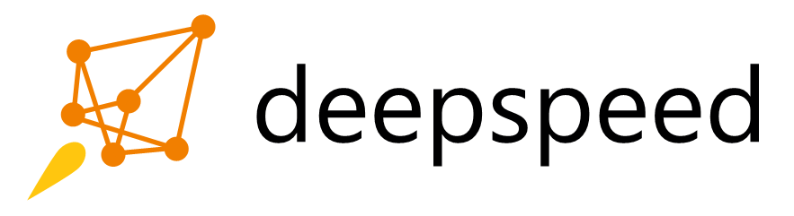

<!-- markdownlint-disable first-line-h1 -->
<!-- markdownlint-disable html -->
 

# DeepSpark Open Source Community

  
  
  

 

In the time when everything is computable, applications in various fields are emerging rapidly. Computing power must support practical applications, with versatility and future scalability being crucial metrics for evaluating computing capabilities. As a leading domestic provider of high-end GPGPU chips and supercomputing systems, the Iluvatar CoreX has successfully supported 400+ AI algorithm models by December 2024. We have established collaborations with 400+ customers and ecosystem partners to jointly promote the development of domestic general-purpose computing power. Our products serve multiple fields including smart cities, digital individuals, healthcare, education, telecommunications, and energy.

Guided by the principles of "co-building platforms, sharing ecosystems, and winning together in the industry," the Iluvatar CoreX is committed to collaborating with industry partners to establish the [DeepSpark Open Source Community](https://www.deepspark.org.cn/). By giving back to the open-source community through open-source contributions, we aim to gather community strength, help customers accelerate application deployment and benefit from computing power empowerment, and promote the improvement and development of the industry ecosystem.

Currently, the DeepSpark Open Source Community is primarily focused on building and promoting the [Hundreds of Applications Open Platform](#hundreds-of-applications-open-platform), In the future, more related projects and achievements will be open-sourced through the DeepSpark community.

In August 2023, the DeepSpark Open Source Community signed a strategic cooperation agreement with the [Shanghai Baiyulan Open Source Research Institute](http://baiyulan.org.cn/) to further promote the co-construction and sharing of AI open-source initiatives and drive the improvement and development of the industry ecosystem. In November 2023, the DeepSpark community collaborated with the [OpenI Community](https://openi.pcl.ac.cn/), enabling community users to train models from DeepSparkHub using the [TianGai 100 computing power](https://openi.pcl.ac.cn/iluvatar/TianGai100) provided by OpenI's cloud brain.

We welcome industry partners, community users, and developers to contribute to the DeepSpark Open Source Community in any form. Your active participation is highly anticipated.

--------

## Hundreds of Applications Open Platform

As a leading domestic AI and general-purpose computing application development and evaluation platform, the Hundreds of Applications Open Platform carefully selects hundreds of open-source algorithms and models deeply integrated with industry applications. It supports mainstream ecosystem application frameworks and builds a multi-dimensional evaluation system tailored to industry needs, widely supporting various implementation scenarios.

### Application Algorithms and Models

[DeepSparkHub](https://gitee.com/deep-spark/deepsparkhub) selects hundreds of open-source application algorithms and models, covering various fields of AI and general-purpose computing. It supports mainstream intelligent computing scenarios in the market, including smart cities, digital individuals, healthcare, education, telecommunications, and energy.

[DeepSparkInference](https://gitee.com/deep-spark/deepsparkinference) selects inference model examples and guidance documents based on the independant-developed inference engines IGIE and ixRT. Some models provide evaluation results based on the self-developed GPGPU [ZhiKai 100](https://www.iluvatar.com/productDetails?fullCode=cpjs-yj-tlxltt-zk100).

### IXUCA (Iluvatar CoreX Unified Compute Architecture)

IXUCA is compatible with mainstream GPGPU computing models, providing equivalent components, features, APIs, and algorithms that support mainstream GPU computing. It enables seamless migration of systems or applications with minimal effort. The IXUCA stack includes AI deep learning applications, mainstream frameworks, libraries, compilers and tools, as well as runtime libraries and drivers.

- IXUCA integrates mainstream deep learning frameworks such as TensorFlow, PyTorch, and PaddlePaddle, delivering operators consistent with official open-source frameworks while continuously optimizing performance for Iluvatar CoreX acceleration cards.

- IXUCA provides the IGIE inference framework and ixRT inference engine, enabling optimal inference performance on Iluvatar CoreX acceleration cards.

- The libraries in IXUCA not only support general-purpose computing but also provide fundamental operators required for deep learning application development. Developers can conveniently utilize these operators to flexibly construct various deep neural network models and other machine learning algorithms.

You can visit the [Resource Center](https://support.iluvatar.com/#/ProductLine?id=2) on Iluvatar CoreX's official website to obtain the IXUCA software stack.

### Application Frameworks

The Hundreds of Applications Open Platform supports mainstream application frameworks and toolkits both domestically and internationally.

<table border="0">
    <tr align="center">
        <td><a href="https://github.com/pytorch"></td>
        <td><a href="https://github.com/tensorflow"></td>
    </tr>
    <tr align="center">
        <td><a href="https://github.com/paddlepaddle"></td>
        <td><a href="https://github.com/microsoft/DeepSpeed"></td>
    </tr>
    <tr align="center">
        <td><a href="https://github.com/facebookresearch/fairseq"></td>
        <td><a href="https://github.com/open-mmlab/mmdetection"></td>
    </tr>
    <tr align="center">
        <td><a href="https://github.com/wenet-e2e/wenet"></td>
        <td><a href="https://github.com/hpcaitech/ColossalAI"></td>
    </tr>
    <tr align="center">
        <td><a href="https://github.com/deepmodeling"></td>
        <td><a href="https://github.com/hiyouga/LLaMA-Factory"></td>
    </tr>
</table>

--------

## Community

### Code of Conduct

See [Code of Conduct](CODE_OF_CONDUCT.md).

### Contact

Contact <contact@deepspark.org.cn>.

### Contribution

Refer to each project's Contributing Guidelines.

### License

[Apache License 2.0](LICENSE).
