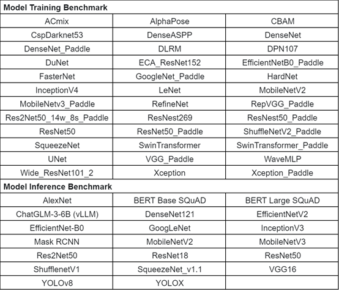

# Introduction

## Multi-Dimensional Benchmark Standards

The benchmark standards are widely applicable to hardware platforms, featuring a comprehensive system and simple deployment.

- Support 6️⃣ dimensions

| Dimension   | Description                                                           | Data Source                      | Calculation Method                                                                   |
|-------------|-----------------------------------------------------------------------|----------------------------------|--------------------------------------------------------------------------------------|
| Speed🚀     | Computing power per second for stable model training samples          | DeepSpark training script output | Remove highest/lowest of 5 iterations, take mean of middle 3 values                  |
| Accuracy🎯  | Model convergence accuracy value                                      | DeepSpark training script output | Record accuracy value at convergence                                                 |
| Linearity📈 | Linear scaling performance for cluster training (card/node linearity) | DeepSpark training script output | Multi-card/node speed divided by card/node count, compared to single-card/node speed |
| Power🔌     | Average GPU power consumption during stable training                  | GPU monitoring tool              | Average of multiple power measurements                                               |
| Memory📊    | Average GPU memory usage during stable training                       | GPU monitoring tool              | Average of multiple memory measurements                                              |
| Stability🔧 | Convergence value stability across multiple full training runs        | DeepSpark training script output | 5 full training runs, median as baseline, 20% deduction if any value deviates by ±1% |

Reference: [Hardware Benchmark Results](#hardware-evaluation-methods-and-results)

- 1️⃣-click deployment: Fully automated ✅, reproducible data 🔁, traceable scenarios 🔎

- 0️⃣ platform dependencies: No framework restrictions, no source language restrictions, no hardware restrictions

## Multi-Dimensional Benchmark System

[Multi-Dimensional Benchmark System](https://mdb.deepspark.org.cn:8086) is an online evaluation tool developed based on the [Multi-Dimensional Benchmark Standards](#multi-dimensional-benchmark-standards). It conducts model training evaluations on BI-V100 and NV-V100 accelerator cards under equal conditions across six dimensions (speed, accuracy, linearity, power efficiency, memory efficiency, and stability), collects metrics, and displays them in six-dimensional radar charts, enabling users to comprehensively compare and evaluate the overall capabilities of GPU accelerators. Below is the list of currently supported models:

For usage details, please refer to the [Multi-Dimensional Benchmark System User Guide](Mdims-benchmark.md).

--------

## Hardware evaluation methods and results

### TianGai 100 GPGPU

For evaluation methods, please refer to the [TianGai 100 Six-Dimension Benchmark Guide](six_dimension_howto.md).

The results is as below:

| Task                  | Model      | Convergence Metric | Configuration(x->gpus) | Speed  | Accuracy | Power(W) | Linearity | Memory Usage(GB) | Stability |
|-----------------------|------------|--------------------|------------------------|--------|----------|----------|-----------|------------------|-----------|
| NLP                   | BERT-large | 0.72               | sdk2.2,bs:32,8x,amp    | 214    | 0.72     | 152*8    | 0.96      | 20.3*8           | 1         |
| Recommendation System | DLRM       | AUC:0.75           | sdk2.2,bs:2048,8x,amp  | 793486 | 0.75     | 60*8     | 0.97      | 3.7*8            | 1         |
| Image Classification  | ResNet50   | top1 75.9%         | sdk2.2,bs:512,8x,amp   | 5221   | 76.43%   | 128*8    | 0.97      | 29.1*8           | 1         |
| Image Segmentation    | 3D U-Net   | 0.908              | sdk2.2,bs:4,8x,fp32    | 12     | 0.908    | 152*8    | 0.85      | 19.6*8           | 1         |
| Object Detection      | YOLOv5     | mAP:0.5            | sdk2.2,bs:128,8x,amp   | 1228   | 0.56     | 140*8    | 0.92      | 27.3*8           | 1         |
| Text Detection        | SATRN      | 0.841              | sdk2.2,bs:128,8x,fp32  | 630    | 88.4     | 166*8    | 0.98      | 28.5*8           | 1         |
| Speech Recognition    | Conformer  | 3.72               | sdk2.2,bs:32,8x,fp32   | 380    | 4.79     | 113*8    | 0.82      | 21.5*8           | 1         |
| 3D Reconstruction     | ngp-nerf   | 0.0046             | sdk2.2,bs:1,8x,amp     | 10     | 19.6     | 82*8     | 0.90      | 28.1*8           | 1         |
| Object Tracking       | FairMOT    | MOTA:69.8          | sdk2.2,bs:64,8x,fp32   | 52     | 69.8     | 132*8    | 0.97      | 19.1*8           | 1         |
| Large Model           | CPM        | 0.91               | sdk2.2,bs:128,8x,amp   | 357    | 0.91     | 156*8    | 0.93      | 20.6*8           | 1         |
| Speech Synthesis      | Tacotron2  | score(MOS):4.460   | sdk2.2,bs:128,8x,amp   | 77     | 4.46     | 128*8    | 0.96      | 18.4*8           | 1         |
| New Model             | Wave-MLP   | 80.1               | sdk2.2,bs:256,8x,fp32  | 1026   | 83.1     | 198*8    | 0.98      | 29.4*8           | 1         |