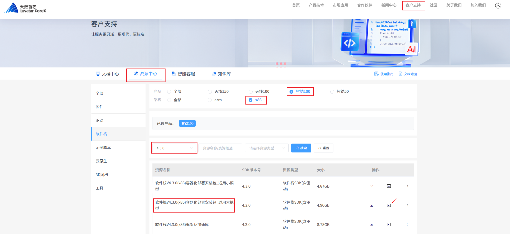
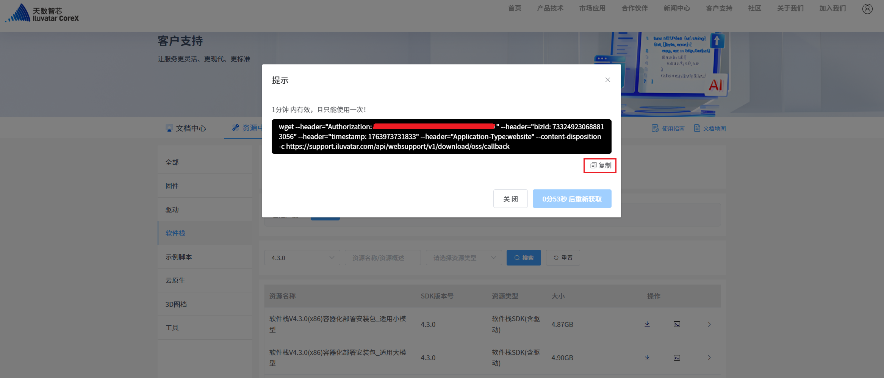
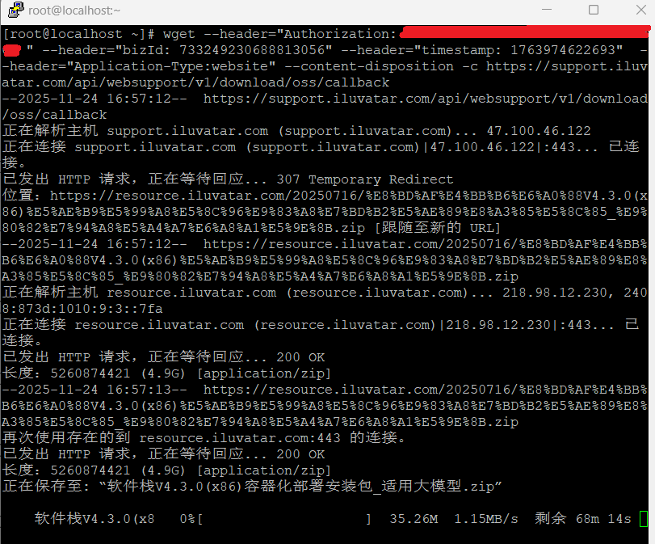
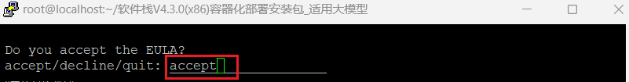
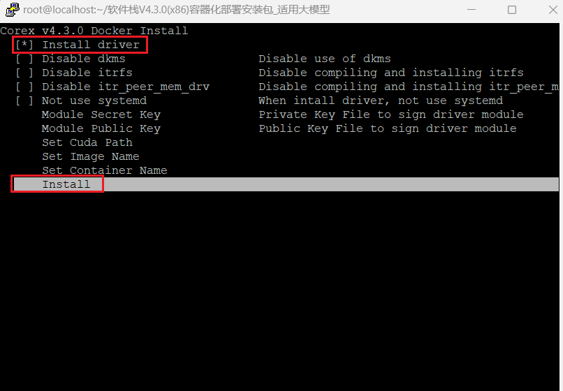
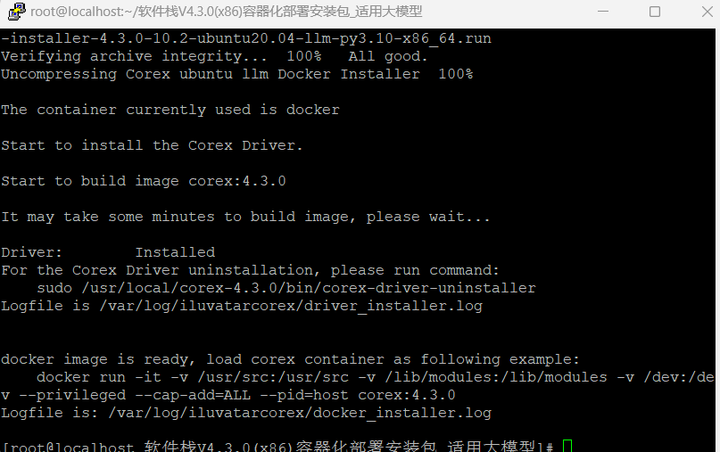

# 快速开始

## 软件栈安装

### 前提条件

- OS: Ubuntu 20.04
- Python: 3.x
- Docker
- make
- GCC && Linux kernel

| Linux kernel版本 | GCC版本 |
|:----------------:|:-------:|
|       3.x        |  GCC 4  |
|    4.0 ~ 4.5     |  GCC 5  |
|    4.6 ~ 5.18    | GCC 7/9 |
|    5.19及以上    | GCC 12  |

- 天数智算软件栈必要的头文件，详情请联系您的应用工程师
- 确认已安装天数卡：

```bash
[root@localhost ~]# lspci -vv | grep 1e3e
# 0003表示天垓150加速卡，0002表示智铠加速卡，0001表示天垓100加速卡。
```

### 以Docker方式安装

我们以天数智算软件栈版本4.3.0为例进行阐述安装过程

步骤 1：登录[天数智芯官网](https://www.iluvatar.com/)，进入`客户支持`>`资源中心`页面进行选择下载。如下图所示，我们选择下载智铠100的大模型软件栈安装包。



步骤 2：点击右侧按钮，生成wget下载链接，然后复制链接到`机器上`执行下载




步骤 3：解压并执行安装

```bash
[root@localhost ~]# unzip '软件栈V4.3.0(x86)容器化部署安装包_适用大模型.zip'
[root@localhost ~]# cd '软件栈V4.3.0(x86)容器化部署安装包_适用大模型'/
[root@localhost 软件栈V4.3.0(x86)容器化部署安装包_适用大模型]# bash corex-docker-installer-4.3.0-10.2-ubuntu20.04-llm-py3.10-x86_64.run
```

步骤 4：如您同意协议的条件条款，请输入`accept`并按回车继续；如您不同意，请输入`decline`，将退出安装。



步骤 5：勾选`Install driver`，选择`Install`，按回车键进行安装



步骤 6：等待安装完成



## 运行模型示例

> 注：如果是小模型，请下载安装适用小模型的软件栈容器。

### 推理模型示例

步骤 1：启动容器并进入

```bash
docker run -itd --name ds_infer_docker -v /usr/src:/usr/src -v /lib/modules:/lib/modules -v /dev:/dev --privileged --cap-add=ALL --pid=host corex:4.3.0
docker exec -it ds_infer_docker bash
```

步骤 2：克隆[DeepSparkInference](https://gitee.com/deep-spark/deepsparkinference)仓库

```bash
git clone --depth 1 https://gitee.com/deep-spark/deepsparkinference
cd deepsparkinference/
```

步骤 3：按照[Qwen2-7B](https://gitee.com/deep-spark/deepsparkinference/tree/master/models/nlp/llm/qwen2-7b/vllm)说明，执行推理

```bash
cat models/nlp/llm/qwen2-7b/vllm/README.md
```

步骤 4：当然您也可以执行[模型库](https://gitee.com/deep-spark/deepsparkinference#%E6%A8%A1%E5%9E%8B%E5%BA%93)列表的任何一个`IXUCA SDK 4.3.0`的模型进行推理

### 训练模型示例

步骤 1：启动容器并进入

```bash
docker run -itd --name ds_train_docker -v /usr/src:/usr/src -v /lib/modules:/lib/modules -v /dev:/dev --privileged --cap-add=ALL --pid=host corex:4.3.0
docker exec -it ds_train_docker bash
```

步骤 2：克隆[DeepSparkHub](https://gitee.com/deep-spark/deepsparkhub)仓库

```bash
git clone --depth 1 https://gitee.com/deep-spark/deepsparkhub
cd deepsparkhub/
```

步骤 3：按照[Llama3-8B](https://gitee.com/deep-spark/deepsparkhub/tree/master/models/nlp/llm/llama3_8b/llamafactory)说明，执行训练

```bash
cat models/nlp/llm/llama3_8b/llamafactory/README.md
```

步骤 4：当然您也可以执行[模型库](https://gitee.com/deep-spark/deepsparkhub#%E6%A8%A1%E5%9E%8B%E5%BA%93)列表的任何一个`IXUCA SDK 4.3.0`的模型进行训练
