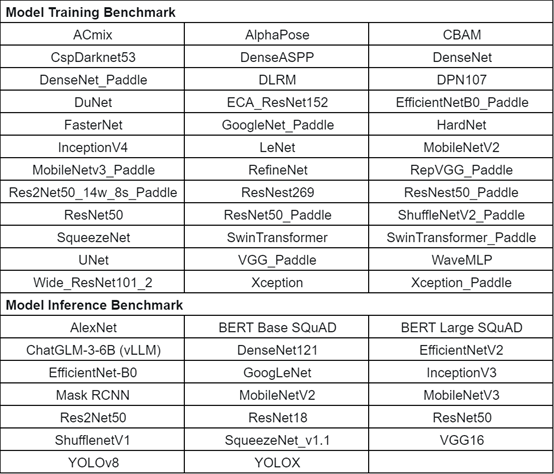
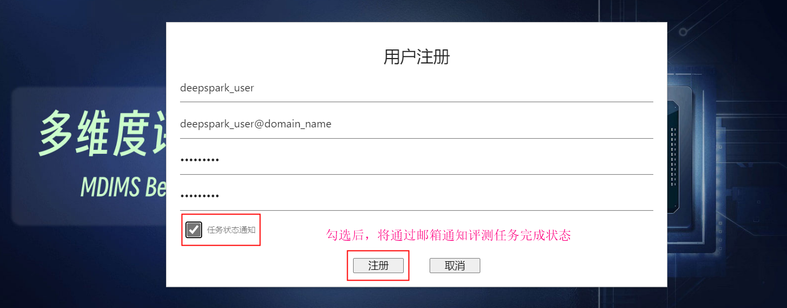
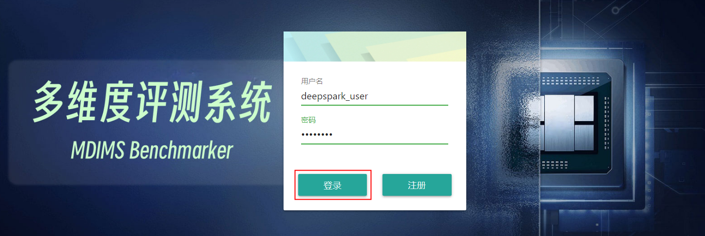
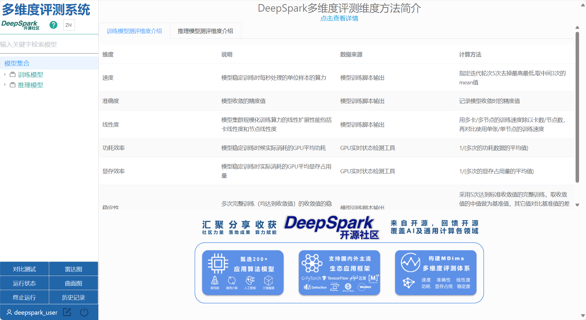
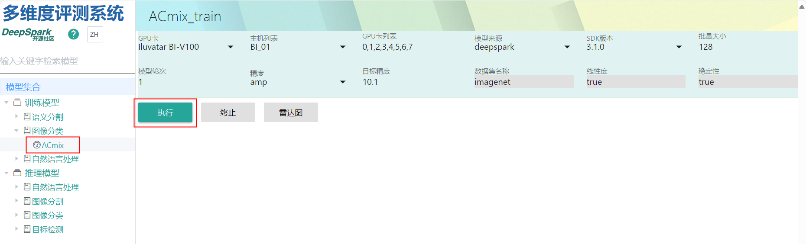
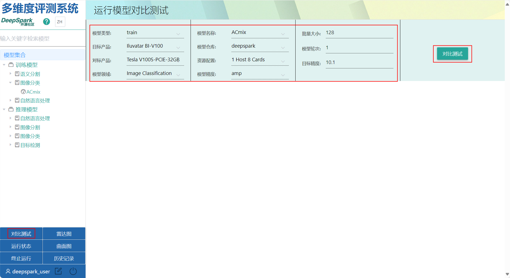
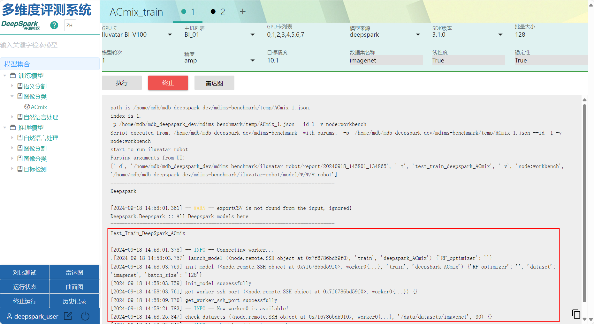
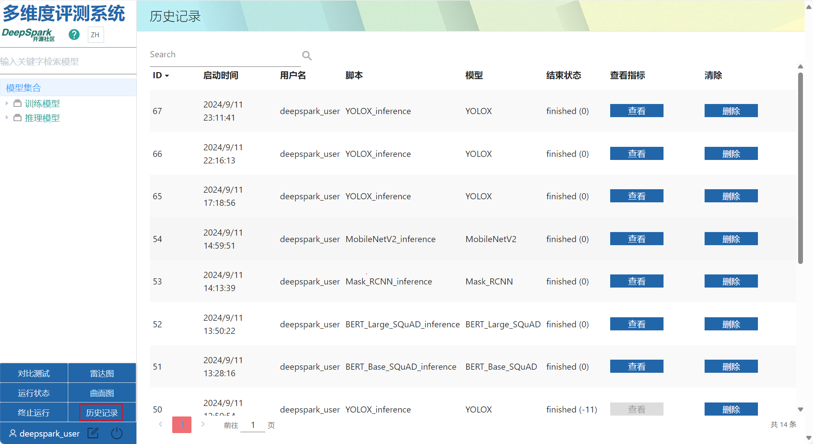
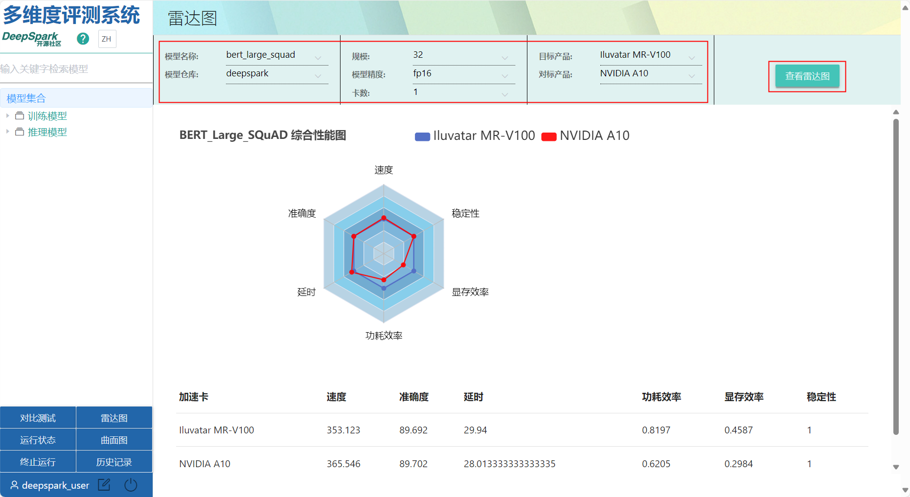
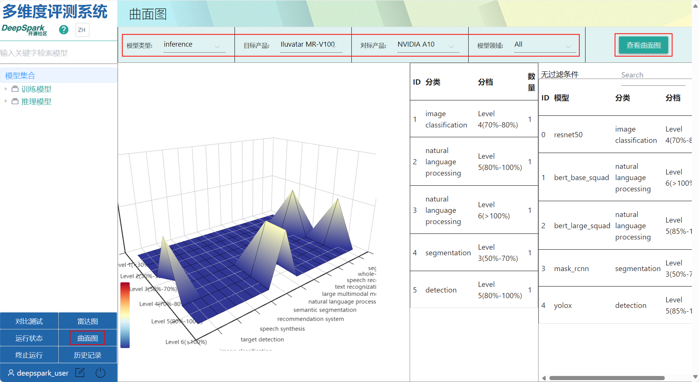

# 多维度评测系统使用指南

## 简介

[多维度评测社区版](https://mdb.deepspark.org.cn:8086)是一款基于[多维度评测体系标准](https://gitee.com/deep-spark/deepspark/blob/master/README.md#%E8%AF%84%E6%B5%8B%E4%BD%93%E7%B3%BB)开发的线上评测工具，通过在同等条件下对BI-V100和NV-V100加速卡在六个维度（速度，准确度，线性度，功耗效率，显存效率，稳定性）上进行模型训练评测、指标收集和六维度雷达图展示，方便用户更加全面的对比评估GPU加速卡的综合能力。
多维度评测社区版第一期的评测模型全部为训练模型，均来自DeepSpark开源社区的[DeepSparkHub](https://gitee.com/deep-spark/deepsparkhub)训练模型仓库，以下为第一期已支持的模型列表：

多维度评测社区版未来还会持续演进，丰富模型类别和添加推理模型多维度评测，欢迎各位第一时间使用和体验。如有任何问题或建议，可随时在DeepSpark开源社区的[Issue标签页](https://gitee.com/deep-spark/deepspark/issues)提交Issue。

## 用户注册

### Step 1：新用户首次使用多维度评测社区版，需要先进行用户注册

### Step 2：填写如下“用户注册”表单，建议勾选“任务状态通知”单选框

### Step 3：完成用户注册后可登录该用户体验多维度评测社区版

### Step 4：多维度评测社区版主界面如下所示

- 左上导航栏`的“?”`问号链接到本帮助文档
- 左中“模型集合”展示了当前支持的模型列表，第一期只支持训练模型，可通过上面的“文本框”进行关键字检索
- 左下“功能导航”表格提供如下功能
  - 对比测试：触发单个模型在两款GPU加速卡上的对比测试
  - 运行状态：可查看当前正在运行或排队的任务列表
  - 终止运行：可一次性终止当前用户正在运行的任务
  - 雷达图：查看单个模型的六维度雷达图(速度，稳定性，线性度，功耗效率，准确度，显存效率)
  - 曲面图：综合查看两款GPU加速卡在各个模型类别下表现的曲面图
  - 历史记录：查看已触发的历史任务日志

## 评测任务

多维度评测社区版支持“指定GPU卡单次评测”和“两款GPU卡对比测试”，评测完成的结果将汇总到数据库中，供雷达图和曲面图展示使用。

> 注：在资源有限的情况下，为保障社区用户的使用体验，触发的评测任务将自动进行排队，且有相应的任务最大配额限制。

### 指定GPU卡单次评测

#### 左中导航栏定位到想跑的模型，并在右上进行参数配置后，点击“执行”按钮，下发评测任务

### 两款GPU卡对比测试

#### Step 1：点击左下的导航栏的“对比测试”按钮，并在右上进行模型选择和参数配置后，点击“对比测试”，下发评测任务

#### Step 2：对比测试任务下发后将显示当前运行脚本列表，点击右侧“终止”按钮可终止指定任务的运行

#### Step 3：点击左侧单个运行脚本名称，将直接跳转到该任务的日志展示页面

#### Step 4： 点击左下的“终止运行”按钮将终止当前用户的所有在运行任务

#### Step 5： 点击左下的“历史记录”按钮，可以查看当前用户的所有的历史任务运行记录

## 结果展示

### 雷达图

#### 点击左下导航栏“雷达图”按钮，在右上进行型选择和参数配置后，点击“查看雷达图”，将展示六维度雷达图

### 曲面图

#### 点击左下导航栏“曲面图”按钮，在右上进程模型选择和参数配置后，点击“查看曲面图”，将展示两款GPU加速卡在各个模型类别下表现的曲面图

## 链接

- 社区网站：<https://www.deepspark.org.cn>

- 工具链接：<https://mdb.deepspark.org.cn:8086>

- 联系我们：<contact@deepspark.org.cn>
